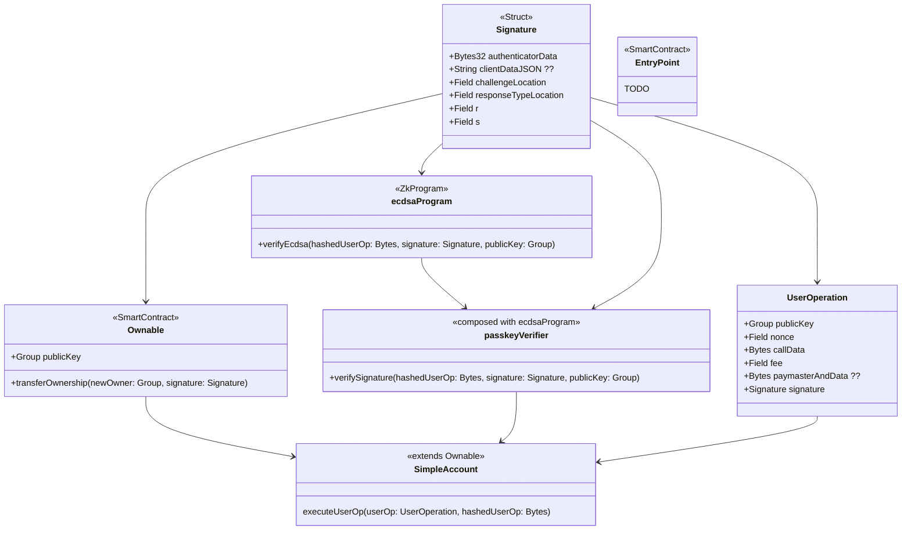

# MinAA

Account Abstraction Proof of Concept over Mina Protocol.

## Diagram

## To do and considerations

PoC Scope:
[ ] Update the implementation of `ecdsaProgram` to allow both `secp256k1` and `secp256r1` (accounts being controllable by both Passkeys, and Ethereum wallets).
[ ] Do we need an actual `EntryPoint` smart contract? Can it be replaced with a simple web server running o1js contracts?

MVP Scope:
[ ] `Paymaster` specification (Since Mina is gasless, the implementation of `Paymaster` will probably be a lot different). Would the paymaster's responsibility be paying the 1 Mina account creation fee, and a fixed (potentially 0.1 Mina) fee per transaction?
[ ] Account deployment to Zeko.
[ ] Batch execution of user operations.
[ ] `Account Factory` contract with an off-line stored addresses deployed to Mina/Zeko.
[ ] Integrate MinAA with Pallad (Add new key agent for Passkeys in Pallad, and signing operations with Passkeys).

Further scope:
[ ] AA+MPC, TypeScript SDK to programmatically deploy and initialize accounts for zkApps.
[ ] Claimable wallets based on OAuth and email.
[ ] Session keys to enable batch execution of user operations.
[ ] Serverless signing and computation like in Lit Protocol.
[ ] Decentralized solution without any Web server. Will it be feasible?

## ERC-4337 vs MinAA

- No gas fees in Mina.
- Provable account deployment and user operations.
